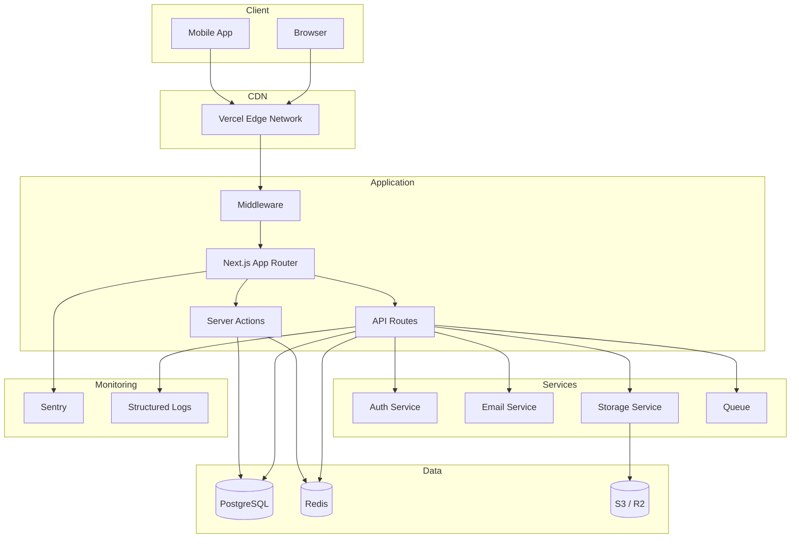
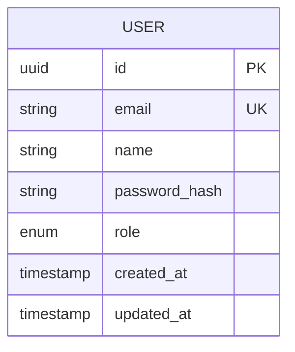
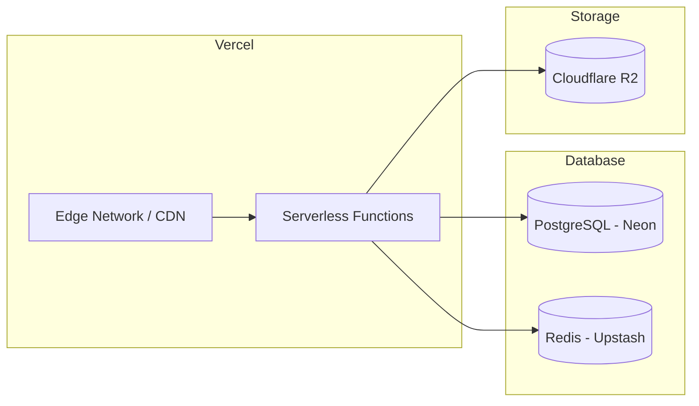

# Technical Architecture — [Project Name]

> Date: YYYY-MM-DD
> Tech Lead: [Name]
> Version: 1.0

---

## 1. Technical Stack

| Layer | Technology | Version | Justification |
|--------|------------|---------|---------------|
| **Framework** | Next.js (App Router) | 15.x | SSR/SSG, Server Components, React ecosystem |
| **Language** | TypeScript | 5.x | Static typing, DX, safe refactoring |
| **Runtime** | Node.js | 20 LTS | Long-term support, performance |
| **Database** | PostgreSQL | 16 | Reliability, JSONB, full-text search |
| **ORM** | Prisma / Drizzle | | Type-safety, migrations |
| **Cache** | Redis | 7 | Sessions, cache, rate limiting |
| **Auth** | [NextAuth / Clerk / Custom] | | [Justification] |
| **UI** | Tailwind CSS + shadcn/ui | | Speed, consistency, accessibility |
| **State** | Zustand / Jotai | | Lightweight, native TypeScript |
| **Validation** | Zod | | Shared client/server schemas |
| **Tests** | Vitest + Testing Library | | Fast, React-compatible |
| **E2E** | Playwright | | Multi-browser, reliable |
| **Linter** | Biome / ESLint | | [Justification of choice] |
| **CI/CD** | GitHub Actions | | Native GitHub integration |
| **Hosting** | Vercel / AWS | | [Justification] |
| **Monitoring** | Sentry | | Error tracking, performance |

---

## 2. Architecture Diagram



---

## 3. Folder Structure

```
project-root/
├── .github/
│   └── workflows/          # CI/CD pipelines
├── .claude/                # Claude Code configuration
│   ├── hooks/
│   ├── skills/
│   ├── templates/
│   └── memory/
├── prisma/
│   ├── schema.prisma       # Database schema
│   └── migrations/         # SQL migrations
├── public/                 # Static assets
├── src/
│   ├── app/                # Next.js App Router
│   │   ├── (auth)/         # Authentication routes
│   │   ├── (dashboard)/    # Dashboard routes
│   │   ├── api/            # API Routes
│   │   ├── layout.tsx      # Root layout
│   │   └── page.tsx        # Home page
│   ├── components/
│   │   ├── ui/             # Generic components (atoms/molecules)
│   │   ├── features/       # Business components (organisms)
│   │   └── layouts/        # Reusable layouts
│   ├── lib/
│   │   ├── db.ts           # Prisma / Drizzle client
│   │   ├── auth.ts         # Auth configuration
│   │   ├── redis.ts        # Redis client
│   │   ├── email.ts        # Email service
│   │   └── utils.ts        # Shared utilities
│   ├── hooks/              # Custom React hooks
│   ├── stores/             # Zustand / Jotai stores
│   ├── types/              # Shared TypeScript types
│   ├── schemas/            # Zod schemas
│   └── config/             # App configuration
├── tests/
│   ├── unit/
│   ├── integration/
│   └── e2e/
├── scripts/                # Utility scripts (seed, migration)
├── docker-compose.yml
├── Dockerfile
├── next.config.ts
├── tailwind.config.ts
├── tsconfig.json
├── biome.json
└── package.json
```

---

## 4. Data Model

### ER Diagram



### Main Tables

| Table | Description | Relations |
|-------|-------------|-----------|
| `users` | Platform users | has_many: [relations] |
| [table 2] | | |
| [table 3] | | |

### Critical Indexes

| Table | Column(s) | Type | Justification |
|-------|-----------|------|---------------|
| `users` | `email` | UNIQUE B-tree | Lookup by email |
| [table] | [column] | [type] | [why] |

---

## 5. API Overview

### Main Endpoints

| Method | Endpoint | Description | Auth |
|---------|----------|-------------|------|
| POST | `/api/v1/auth/login` | Login | No |
| POST | `/api/v1/auth/register` | Registration | No |
| POST | `/api/v1/auth/refresh` | Refresh token | Refresh token |
| GET | `/api/v1/users/me` | Current profile | Bearer |
| [METHOD] | [/api/v1/...] | [Description] | [Auth] |

### Conventions

- Response format: see `api-design.md` skill
- Pagination: cursor-based by default
- Errors: uniform format with application code
- Rate limiting: 100 req/min per authenticated user

---

## 6. Security

### Authentication

| Aspect | Implementation |
|--------|---------------|
| Method | [JWT / Session / OAuth] |
| Token storage | [httpOnly cookie / memory] |
| Access token duration | 15 minutes |
| Refresh token duration | 7 days |
| Password hashing | argon2id |
| MFA | [Optional / Required for admins] |

### Authorization

| Role | Permissions |
|------|------------|
| `user` | CRUD on their own resources |
| `admin` | Everything |
| [role] | [permissions] |

### Security Measures

- [ ] HTTPS everywhere (HSTS)
- [ ] CSP configured
- [ ] Restrictive CORS
- [ ] Rate limiting
- [ ] Zod validation on all inputs
- [ ] Secrets in environment variables
- [ ] Dependency auditing (`npm audit`)
- [ ] Security headers

---

## 7. Performance Budget

| Metric | Target | Measurement Tool |
|----------|-------|----------------|
| LCP (Largest Contentful Paint) | < 2.5s | Lighthouse / Web Vitals |
| FID (First Input Delay) | < 100ms | Web Vitals |
| CLS (Cumulative Layout Shift) | < 0.1 | Lighthouse |
| TTFB (Time to First Byte) | < 200ms | Vercel Analytics |
| Initial JS bundle | < 100 KB gzip | `next build` |
| API P95 latency | < 200ms | Sentry |
| Lighthouse score | > 90 | Lighthouse CI |

### Optimization Strategies

- Server Components by default (zero client JS)
- Optimized images (`next/image`)
- Optimized fonts (`next/font`)
- Automatic code splitting (App Router)
- Aggressive caching (ISR + Redis)
- Lazy loading of non-critical components

---

## 8. Infrastructure

### Environments

| Environment | URL | Branch | Deployment |
|--------------|-----|---------|-------------|
| Production | [https://app.example.com] | `main` | Automatic |
| Staging | [https://staging.example.com] | `develop` | Automatic |
| Preview | [dynamic URL] | PR branches | Automatic |
| Local | http://localhost:3000 | — | Manual |

### Third-party Services

| Service | Usage | Tier / Cost |
|---------|-------|------------|
| [Vercel] | Hosting | [Pro / $20/month] |
| [Neon / Supabase] | PostgreSQL | [Free / Pro] |
| [Upstash] | Redis | [Free / Pay-as-you-go] |
| [Resend] | Email | [Free tier] |
| [Sentry] | Monitoring | [Developer / Free] |
| [Cloudflare R2] | File storage | [Pay-as-you-go] |

### Infrastructure Diagram



---

## Technical Decision History (ADR)

| Date | Decision | Alternatives Considered | Reason |
|------|----------|------------------------|--------|
| | [Ex: Choice of Prisma vs Drizzle] | [Drizzle, Kysely, raw SQL] | [Reason] |
| | | | |
